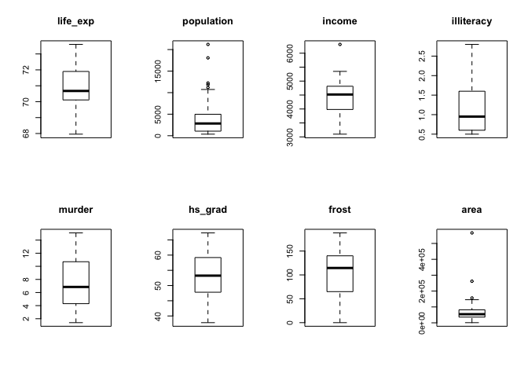
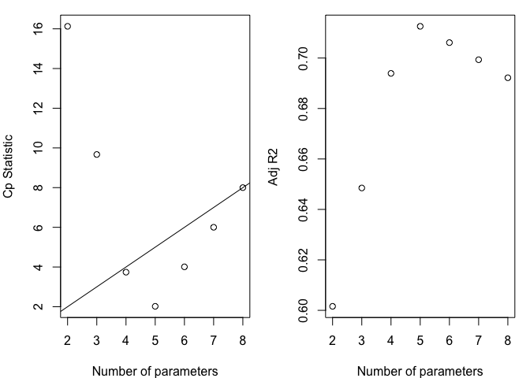
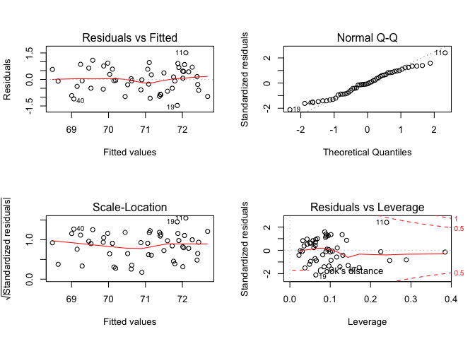
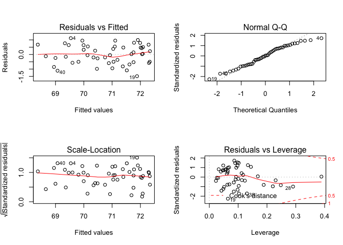

Methods\_hw5
================
Yishan Wang
2018-11-24

``` r
state_data = state.x77 %>%
  data.frame() %>%
  janitor::clean_names() %>%
  rownames_to_column(var = "state")
```

Question 1
==========

Generate appropriate descriptive statistics for continous variables:

``` r
state_data %>%
  summary()
```

    ##     state             population        income       illiteracy   
    ##  Length:50          Min.   :  365   Min.   :3098   Min.   :0.500  
    ##  Class :character   1st Qu.: 1080   1st Qu.:3993   1st Qu.:0.625  
    ##  Mode  :character   Median : 2838   Median :4519   Median :0.950  
    ##                     Mean   : 4246   Mean   :4436   Mean   :1.170  
    ##                     3rd Qu.: 4968   3rd Qu.:4814   3rd Qu.:1.575  
    ##                     Max.   :21198   Max.   :6315   Max.   :2.800  
    ##     life_exp         murder          hs_grad          frost       
    ##  Min.   :67.96   Min.   : 1.400   Min.   :37.80   Min.   :  0.00  
    ##  1st Qu.:70.12   1st Qu.: 4.350   1st Qu.:48.05   1st Qu.: 66.25  
    ##  Median :70.67   Median : 6.850   Median :53.25   Median :114.50  
    ##  Mean   :70.88   Mean   : 7.378   Mean   :53.11   Mean   :104.46  
    ##  3rd Qu.:71.89   3rd Qu.:10.675   3rd Qu.:59.15   3rd Qu.:139.75  
    ##  Max.   :73.60   Max.   :15.100   Max.   :67.30   Max.   :188.00  
    ##       area       
    ##  Min.   :  1049  
    ##  1st Qu.: 36985  
    ##  Median : 54277  
    ##  Mean   : 70736  
    ##  3rd Qu.: 81162  
    ##  Max.   :566432

Explore the dataset and generate relevant graphs for all variables of interest:

``` r
data_without_state = state_data %>%
  select(-state) %>%
  select(life_exp, population, income, illiteracy, murder, hs_grad, frost, area)

# Find possible multicollinearity
data_without_state %>%
  pairs()
```


``` r
Hmisc::rcorr(as.matrix(data_without_state)) %>%
  broom::tidy() %>%
  mutate(abs_estimate = abs(estimate)) %>%
  filter(abs_estimate >= 0.5) %>% 
  knitr::kable(digits = 3)
```

| column1    | column2    |  estimate|    n|  p.value|  abs\_estimate|
|:-----------|:-----------|---------:|----:|--------:|--------------:|
| life\_exp  | illiteracy |    -0.588|   50|        0|          0.588|
| life\_exp  | murder     |    -0.781|   50|        0|          0.781|
| illiteracy | murder     |     0.703|   50|        0|          0.703|
| life\_exp  | hs\_grad   |     0.582|   50|        0|          0.582|
| income     | hs\_grad   |     0.620|   50|        0|          0.620|
| illiteracy | hs\_grad   |    -0.657|   50|        0|          0.657|
| illiteracy | frost      |    -0.672|   50|        0|          0.672|
| murder     | frost      |    -0.539|   50|        0|          0.539|

``` r
# Boxplots for each variable
par(mfrow = c(2, 4))
boxplot(data_without_state$life_exp, main = 'life_exp')
boxplot(data_without_state$population, main = 'population')
boxplot(data_without_state$income, main = 'income')
boxplot(data_without_state$illiteracy, main = 'illiteracy')
boxplot(data_without_state$murder, main = 'murder')
boxplot(data_without_state$hs_grad, main = 'hs_grad')
boxplot(data_without_state$frost, main = 'frost')
boxplot(data_without_state$area, main = 'area')
```



Question 2
==========

Use automatic procedures to find a ‘best subset’ of the full model.

### a)

``` r
mod = lm(life_exp ~ population + income + illiteracy + murder + hs_grad + frost + area, data = state_data)

step(mod, direction = 'forward')
```

    ## Start:  AIC=-22.18
    ## life_exp ~ population + income + illiteracy + murder + hs_grad + 
    ##     frost + area

    ## 
    ## Call:
    ## lm(formula = life_exp ~ population + income + illiteracy + murder + 
    ##     hs_grad + frost + area, data = state_data)
    ## 
    ## Coefficients:
    ## (Intercept)   population       income   illiteracy       murder  
    ##   7.094e+01    5.180e-05   -2.180e-05    3.382e-02   -3.011e-01  
    ##     hs_grad        frost         area  
    ##   4.893e-02   -5.735e-03   -7.383e-08

``` r
step(mod, direction = 'backward')
```

    ## Start:  AIC=-22.18
    ## life_exp ~ population + income + illiteracy + murder + hs_grad + 
    ##     frost + area
    ## 
    ##              Df Sum of Sq    RSS     AIC
    ## - area        1    0.0011 23.298 -24.182
    ## - income      1    0.0044 23.302 -24.175
    ## - illiteracy  1    0.0047 23.302 -24.174
    ## <none>                    23.297 -22.185
    ## - population  1    1.7472 25.044 -20.569
    ## - frost       1    1.8466 25.144 -20.371
    ## - hs_grad     1    2.4413 25.738 -19.202
    ## - murder      1   23.1411 46.438  10.305
    ## 
    ## Step:  AIC=-24.18
    ## life_exp ~ population + income + illiteracy + murder + hs_grad + 
    ##     frost
    ## 
    ##              Df Sum of Sq    RSS     AIC
    ## - illiteracy  1    0.0038 23.302 -26.174
    ## - income      1    0.0059 23.304 -26.170
    ## <none>                    23.298 -24.182
    ## - population  1    1.7599 25.058 -22.541
    ## - frost       1    2.0488 25.347 -21.968
    ## - hs_grad     1    2.9804 26.279 -20.163
    ## - murder      1   26.2721 49.570  11.569
    ## 
    ## Step:  AIC=-26.17
    ## life_exp ~ population + income + murder + hs_grad + frost
    ## 
    ##              Df Sum of Sq    RSS     AIC
    ## - income      1     0.006 23.308 -28.161
    ## <none>                    23.302 -26.174
    ## - population  1     1.887 25.189 -24.280
    ## - frost       1     3.037 26.339 -22.048
    ## - hs_grad     1     3.495 26.797 -21.187
    ## - murder      1    34.739 58.041  17.456
    ## 
    ## Step:  AIC=-28.16
    ## life_exp ~ population + murder + hs_grad + frost
    ## 
    ##              Df Sum of Sq    RSS     AIC
    ## <none>                    23.308 -28.161
    ## - population  1     2.064 25.372 -25.920
    ## - frost       1     3.122 26.430 -23.877
    ## - hs_grad     1     5.112 28.420 -20.246
    ## - murder      1    34.816 58.124  15.528

    ## 
    ## Call:
    ## lm(formula = life_exp ~ population + murder + hs_grad + frost, 
    ##     data = state_data)
    ## 
    ## Coefficients:
    ## (Intercept)   population       murder      hs_grad        frost  
    ##   7.103e+01    5.014e-05   -3.001e-01    4.658e-02   -5.943e-03

``` r
step(mod, direction = 'both')
```

    ## Start:  AIC=-22.18
    ## life_exp ~ population + income + illiteracy + murder + hs_grad + 
    ##     frost + area
    ## 
    ##              Df Sum of Sq    RSS     AIC
    ## - area        1    0.0011 23.298 -24.182
    ## - income      1    0.0044 23.302 -24.175
    ## - illiteracy  1    0.0047 23.302 -24.174
    ## <none>                    23.297 -22.185
    ## - population  1    1.7472 25.044 -20.569
    ## - frost       1    1.8466 25.144 -20.371
    ## - hs_grad     1    2.4413 25.738 -19.202
    ## - murder      1   23.1411 46.438  10.305
    ## 
    ## Step:  AIC=-24.18
    ## life_exp ~ population + income + illiteracy + murder + hs_grad + 
    ##     frost
    ## 
    ##              Df Sum of Sq    RSS     AIC
    ## - illiteracy  1    0.0038 23.302 -26.174
    ## - income      1    0.0059 23.304 -26.170
    ## <none>                    23.298 -24.182
    ## - population  1    1.7599 25.058 -22.541
    ## + area        1    0.0011 23.297 -22.185
    ## - frost       1    2.0488 25.347 -21.968
    ## - hs_grad     1    2.9804 26.279 -20.163
    ## - murder      1   26.2721 49.570  11.569
    ## 
    ## Step:  AIC=-26.17
    ## life_exp ~ population + income + murder + hs_grad + frost
    ## 
    ##              Df Sum of Sq    RSS     AIC
    ## - income      1     0.006 23.308 -28.161
    ## <none>                    23.302 -26.174
    ## - population  1     1.887 25.189 -24.280
    ## + illiteracy  1     0.004 23.298 -24.182
    ## + area        1     0.000 23.302 -24.174
    ## - frost       1     3.037 26.339 -22.048
    ## - hs_grad     1     3.495 26.797 -21.187
    ## - murder      1    34.739 58.041  17.456
    ## 
    ## Step:  AIC=-28.16
    ## life_exp ~ population + murder + hs_grad + frost
    ## 
    ##              Df Sum of Sq    RSS     AIC
    ## <none>                    23.308 -28.161
    ## + income      1     0.006 23.302 -26.174
    ## + illiteracy  1     0.004 23.304 -26.170
    ## + area        1     0.001 23.307 -26.163
    ## - population  1     2.064 25.372 -25.920
    ## - frost       1     3.122 26.430 -23.877
    ## - hs_grad     1     5.112 28.420 -20.246
    ## - murder      1    34.816 58.124  15.528

    ## 
    ## Call:
    ## lm(formula = life_exp ~ population + murder + hs_grad + frost, 
    ##     data = state_data)
    ## 
    ## Coefficients:
    ## (Intercept)   population       murder      hs_grad        frost  
    ##   7.103e+01    5.014e-05   -3.001e-01    4.658e-02   -5.943e-03

No, forward direction procedure generates different submodel from backward direction procedure and both direction procedure. The submodel I selected is: life\_exp ~ population + murder + hs\_grad + frost.

### b)

``` r
submod = lm(life_exp ~ population + murder + hs_grad + frost, data = state_data)
summary(submod)
```

    ## 
    ## Call:
    ## lm(formula = life_exp ~ population + murder + hs_grad + frost, 
    ##     data = state_data)
    ## 
    ## Residuals:
    ##      Min       1Q   Median       3Q      Max 
    ## -1.47095 -0.53464 -0.03701  0.57621  1.50683 
    ## 
    ## Coefficients:
    ##               Estimate Std. Error t value Pr(>|t|)    
    ## (Intercept)  7.103e+01  9.529e-01  74.542  < 2e-16 ***
    ## population   5.014e-05  2.512e-05   1.996  0.05201 .  
    ## murder      -3.001e-01  3.661e-02  -8.199 1.77e-10 ***
    ## hs_grad      4.658e-02  1.483e-02   3.142  0.00297 ** 
    ## frost       -5.943e-03  2.421e-03  -2.455  0.01802 *  
    ## ---
    ## Signif. codes:  0 '***' 0.001 '**' 0.01 '*' 0.05 '.' 0.1 ' ' 1
    ## 
    ## Residual standard error: 0.7197 on 45 degrees of freedom
    ## Multiple R-squared:  0.736,  Adjusted R-squared:  0.7126 
    ## F-statistic: 31.37 on 4 and 45 DF,  p-value: 1.696e-12

Yes, population is a close call because the its p-value is greater than 0.05.

``` r
new_submod = lm(life_exp ~ murder + hs_grad + frost, data = state_data)
summary(new_submod)
```

    ## 
    ## Call:
    ## lm(formula = life_exp ~ murder + hs_grad + frost, data = state_data)
    ## 
    ## Residuals:
    ##     Min      1Q  Median      3Q     Max 
    ## -1.5015 -0.5391  0.1014  0.5921  1.2268 
    ## 
    ## Coefficients:
    ##              Estimate Std. Error t value Pr(>|t|)    
    ## (Intercept) 71.036379   0.983262  72.246  < 2e-16 ***
    ## murder      -0.283065   0.036731  -7.706 8.04e-10 ***
    ## hs_grad      0.049949   0.015201   3.286  0.00195 ** 
    ## frost       -0.006912   0.002447  -2.824  0.00699 ** 
    ## ---
    ## Signif. codes:  0 '***' 0.001 '**' 0.01 '*' 0.05 '.' 0.1 ' ' 1
    ## 
    ## Residual standard error: 0.7427 on 46 degrees of freedom
    ## Multiple R-squared:  0.7127, Adjusted R-squared:  0.6939 
    ## F-statistic: 38.03 on 3 and 46 DF,  p-value: 1.634e-12

I'll discard population since both R-squared and adjusted R-squared don't have significant dicrease after discarding population. And frost becomes more significant after discarding population. The model is still significant after discarding population because the small p-value of F test.

### c)

There is a strong negative association between illiteracy and hs\_grad. (please see Question 1) No, the subset model doesn't include both of those two variables. We don't need to worry about multicollinearity.

Question 3
==========

Use criterion-based procedures to select the ‘best subset’.

``` r
# Printing the 2 best models of each size, using the Cp criterion:
leaps(x = data_without_state[, 2:8], y = data_without_state[, 1], nbest = 2, method = "Cp")
```

    ## $which
    ##       1     2     3     4     5     6     7
    ## 1 FALSE FALSE FALSE  TRUE FALSE FALSE FALSE
    ## 1 FALSE FALSE  TRUE FALSE FALSE FALSE FALSE
    ## 2 FALSE FALSE FALSE  TRUE  TRUE FALSE FALSE
    ## 2  TRUE FALSE FALSE  TRUE FALSE FALSE FALSE
    ## 3 FALSE FALSE FALSE  TRUE  TRUE  TRUE FALSE
    ## 3  TRUE FALSE FALSE  TRUE  TRUE FALSE FALSE
    ## 4  TRUE FALSE FALSE  TRUE  TRUE  TRUE FALSE
    ## 4 FALSE  TRUE FALSE  TRUE  TRUE  TRUE FALSE
    ## 5  TRUE  TRUE FALSE  TRUE  TRUE  TRUE FALSE
    ## 5  TRUE FALSE  TRUE  TRUE  TRUE  TRUE FALSE
    ## 6  TRUE  TRUE  TRUE  TRUE  TRUE  TRUE FALSE
    ## 6  TRUE FALSE  TRUE  TRUE  TRUE  TRUE  TRUE
    ## 7  TRUE  TRUE  TRUE  TRUE  TRUE  TRUE  TRUE
    ## 
    ## $label
    ## [1] "(Intercept)" "1"           "2"           "3"           "4"          
    ## [6] "5"           "6"           "7"          
    ## 
    ## $size
    ##  [1] 2 2 3 3 4 4 5 5 6 6 7 7 8
    ## 
    ## $Cp
    ##  [1] 16.126760 58.058325  9.669894 10.886508  3.739878  5.647595  2.019659
    ##  [8]  5.411184  4.008737  4.012588  6.001959  6.007958  8.000000

``` r
# Printing the 2 best models of each size, using the adjusted R^2 criterion:
leaps(x = data_without_state[, 2:8], y = data_without_state[, 1], nbest = 2, method = "adjr2")
```

    ## $which
    ##       1     2     3     4     5     6     7
    ## 1 FALSE FALSE FALSE  TRUE FALSE FALSE FALSE
    ## 1 FALSE FALSE  TRUE FALSE FALSE FALSE FALSE
    ## 2 FALSE FALSE FALSE  TRUE  TRUE FALSE FALSE
    ## 2  TRUE FALSE FALSE  TRUE FALSE FALSE FALSE
    ## 3 FALSE FALSE FALSE  TRUE  TRUE  TRUE FALSE
    ## 3  TRUE FALSE FALSE  TRUE  TRUE FALSE FALSE
    ## 4  TRUE FALSE FALSE  TRUE  TRUE  TRUE FALSE
    ## 4 FALSE  TRUE FALSE  TRUE  TRUE  TRUE FALSE
    ## 5  TRUE  TRUE FALSE  TRUE  TRUE  TRUE FALSE
    ## 5  TRUE FALSE  TRUE  TRUE  TRUE  TRUE FALSE
    ## 6  TRUE  TRUE  TRUE  TRUE  TRUE  TRUE FALSE
    ## 6  TRUE FALSE  TRUE  TRUE  TRUE  TRUE  TRUE
    ## 7  TRUE  TRUE  TRUE  TRUE  TRUE  TRUE  TRUE
    ## 
    ## $label
    ## [1] "(Intercept)" "1"           "2"           "3"           "4"          
    ## [6] "5"           "6"           "7"          
    ## 
    ## $size
    ##  [1] 2 2 3 3 4 4 5 5 6 6 7 7 8
    ## 
    ## $adjr2
    ##  [1] 0.6015893 0.3326876 0.6484991 0.6405311 0.6939230 0.6811571 0.7125690
    ##  [8] 0.6893697 0.7061129 0.7060860 0.6993268 0.6992839 0.6921823

``` r
# Summary of models for each size (one model per size)
b = regsubsets(life_exp ~ ., data = data_without_state, nbest = 1)
rs = summary(b, matrix.logical = TRUE)
rs
```

    ## Subset selection object
    ## Call: regsubsets.formula(life_exp ~ ., data = data_without_state, nbest = 1)
    ## 7 Variables  (and intercept)
    ##            Forced in Forced out
    ## population     FALSE      FALSE
    ## income         FALSE      FALSE
    ## illiteracy     FALSE      FALSE
    ## murder         FALSE      FALSE
    ## hs_grad        FALSE      FALSE
    ## frost          FALSE      FALSE
    ## area           FALSE      FALSE
    ## 1 subsets of each size up to 7
    ## Selection Algorithm: exhaustive
    ##          population income illiteracy murder hs_grad frost  area
    ## 1  ( 1 )      FALSE  FALSE      FALSE   TRUE   FALSE FALSE FALSE
    ## 2  ( 1 )      FALSE  FALSE      FALSE   TRUE    TRUE FALSE FALSE
    ## 3  ( 1 )      FALSE  FALSE      FALSE   TRUE    TRUE  TRUE FALSE
    ## 4  ( 1 )       TRUE  FALSE      FALSE   TRUE    TRUE  TRUE FALSE
    ## 5  ( 1 )       TRUE   TRUE      FALSE   TRUE    TRUE  TRUE FALSE
    ## 6  ( 1 )       TRUE   TRUE       TRUE   TRUE    TRUE  TRUE FALSE
    ## 7  ( 1 )       TRUE   TRUE       TRUE   TRUE    TRUE  TRUE  TRUE

``` r
# Plots of Cp and Adj-R2 as functions of parameters
par(mar = c(4, 4, 1, 1))
par(mfrow = c(1, 2))

plot(2:8, rs$cp, xlab = "Number of parameters", ylab = "Cp Statistic")
abline(0, 1)

plot(2:8, rs$adjr2, xlab = "Number of parameters", ylab = "Adj R2")
```



``` r
# AIC of the 4-predictor model:
multi.fit4 = lm(life_exp ~ population + murder + hs_grad + frost, data = state_data)
AIC(multi.fit4)
```

    ## [1] 115.7326

``` r
# BIC of the 4-predictor model:
AIC(multi.fit4, k = log(length(state_data$life_exp)))
```

    ## [1] 127.2048

``` r
# AIC of the 5-predictor model:
multi.fit5 = lm(life_exp ~ population + income + murder + hs_grad + frost, data = state_data)
AIC(multi.fit5)
```

    ## [1] 117.7196

``` r
# BIC of the 5-predictor model:
AIC(multi.fit5, k = log(length(state_data$life_exp)))
```

    ## [1] 131.1038

``` r
best = function(model, ...) 
{
  subsets = regsubsets(formula(model), model.frame(model), ...)
  subsets = with(summary(subsets),
                  cbind(p = as.numeric(rownames(which)), which, rss, rsq, adjr2, cp, bic))
  
  return(subsets)
}  

# Select the 'best' model of all subsets for 4-predictor model
round(best(multi.fit4, nbest = 1), 4)
```

    ##   p (Intercept) population murder hs_grad frost     rss    rsq  adjr2
    ## 1 1           1          0      1       0     0 34.4613 0.6097 0.6016
    ## 2 2           1          0      1       1     0 29.7704 0.6628 0.6485
    ## 3 3           1          0      1       1     1 25.3716 0.7127 0.6939
    ## 4 4           1          1      1       1     1 23.3080 0.7360 0.7126
    ##        cp      bic
    ## 1 20.5332 -39.2205
    ## 2 13.4766 -42.6247
    ## 3  6.9841 -46.7068
    ## 4  5.0000 -47.0364

The best subset model I selected based on Cp, Adj-R^2, AIC, BIC is: life\_exp ~ population + murder + hs\_grad + frost.

Problem 4
=========

Compare the two ‘subsets’ from parts 2 and 3 and recommend a ‘final’ model.

Although I discarded population in the model `life_exp ~ population + murder + hs_grad + frost` since both R-squared and adjusted R-squared don't have significant dicrease after discarding population, criterion-based procedures showed that I shouldn't have discarded population based on Cp, Adj-R^2, AIC, BIC criterions. So the final model I recommend is: life\_exp ~ population + murder + hs\_grad + frost.

### a)

Identify any leverage and/or influential points and take appropriate measures.

``` r
# rstandard function gives the internally studentized residuals 
stu_res = rstandard(multi.fit4)
outliers_y = stu_res[abs(stu_res) > 2.5]
outliers_y
```

    ## named numeric(0)

``` r
# Measures of influence:
# Gives DFFITS, Cook's Distance, Hat diagonal elements, and others.
influence.measures(multi.fit4)
```

    ## Influence measures of
    ##   lm(formula = life_exp ~ population + murder + hs_grad + frost,      data = state_data) :
    ## 
    ##       dfb.1_  dfb.pplt  dfb.mrdr  dfb.hs_g  dfb.frst    dffit cov.r
    ## 1   0.035492 -1.31e-01  1.81e-01 -0.040552 -0.093627  0.34385 1.200
    ## 2   0.410334  1.83e-01 -4.02e-01 -0.349223 -0.164049 -0.50117 1.364
    ## 3   0.015219  2.09e-01  5.00e-02 -0.236749  0.457644 -0.53734 1.081
    ## 4   0.329890 -1.72e-01  2.46e-03 -0.317837 -0.087569  0.49350 0.921
    ## 5   0.035541 -9.14e-02  4.05e-03 -0.044178  0.026988 -0.11867 1.814
    ## 6  -0.316742 -5.38e-02  2.18e-01  0.272452  0.219005  0.44171 0.986
    ## 7   0.051252  1.77e-02 -9.17e-02 -0.024669  0.010955  0.14381 1.125
    ## 8  -0.047471  1.85e-01  3.13e-02 -0.036008  0.090584 -0.30196 0.896
    ## 9  -0.000547  2.67e-03  9.55e-04  0.006028 -0.014997  0.02107 1.238
    ## 10 -0.008460  8.05e-03 -2.53e-02  0.016126 -0.003117 -0.04691 1.241
    ## 11 -0.033009 -5.69e-01 -2.76e-01  0.664444 -1.244026  1.42824 0.741
    ## 12 -0.025510 -5.09e-02  7.21e-05  0.049597 -0.006575  0.11025 1.134
    ## 13  0.007812 -1.81e-02 -9.37e-03 -0.000558 -0.014652 -0.02615 1.250
    ## 14 -0.000389 -1.61e-03  7.15e-05  0.000713 -0.001883 -0.00488 1.148
    ## 15  0.012296  5.30e-03 -3.71e-02  0.002013 -0.001564  0.05819 1.182
    ## 16 -0.017022 -4.31e-02 -6.33e-02  0.084668 -0.057912  0.20256 1.054
    ## 17  0.235268 -5.35e-02  5.72e-02 -0.303436  0.095100  0.40778 1.036
    ## 18 -0.057605  7.39e-02 -5.88e-02  0.036101  0.101646 -0.20714 1.219
    ## 19 -0.221919  4.84e-02  2.91e-01  0.174087 -0.166830 -0.57681 0.709
    ## 20  0.002387  7.62e-03 -1.99e-02 -0.003218 -0.004869 -0.06309 1.122
    ## 21 -0.052828 -8.12e-02  1.63e-01 -0.023468  0.081194 -0.23178 1.098
    ## 22 -0.146492  1.63e-01  2.01e-01  0.041939  0.203775  0.34590 1.069
    ## 23  0.061153  7.86e-02 -1.55e-01 -0.036661  0.075346  0.27039 1.073
    ## 24 -0.152293  1.93e-01 -1.58e-01  0.159679  0.083500 -0.44227 1.011
    ## 25  0.020092  6.51e-03  5.33e-02 -0.046052  0.055511  0.14957 1.071
    ## 26  0.071108  9.14e-02 -2.42e-02 -0.080966 -0.098656 -0.27162 1.000
    ## 27  0.016596 -2.02e-02 -7.07e-02  0.020076 -0.005414  0.14244 1.132
    ## 28  0.402992  1.43e-01 -4.24e-01 -0.288096 -0.283276 -0.51725 1.460
    ## 29 -0.009464  2.56e-02  4.10e-02  0.008083 -0.085716 -0.18242 1.127
    ## 30 -0.088716 -1.38e-01  1.24e-01  0.071170 -0.017018 -0.21995 1.065
    ## 31 -0.049072 -5.53e-02  7.62e-02  0.039222  0.028848  0.10637 1.171
    ## 32  0.011393 -6.01e-02 -4.89e-03 -0.002487 -0.012640 -0.06681 1.442
    ## 33 -0.019970 -1.75e-03 -3.80e-03  0.025276 -0.005219 -0.03437 1.227
    ## 34  0.291080  9.70e-03 -2.82e-01 -0.297496  0.209852  0.52382 1.047
    ## 35  0.002238 -9.51e-02  1.05e-02  0.013510 -0.044242 -0.11347 1.198
    ## 36  0.035812 -1.99e-02 -2.89e-02 -0.011934 -0.037269  0.07001 1.142
    ## 37 -0.023790  3.95e-02  7.55e-02 -0.054191  0.135471 -0.16331 1.262
    ## 38 -0.139407 -4.61e-01  1.88e-01  0.193251 -0.169119 -0.53682 1.019
    ## 39  0.062823 -5.58e-03 -5.47e-02 -0.051111 -0.004418  0.07465 1.262
    ## 40 -0.317583  1.58e-01 -9.62e-02  0.357681  0.020151 -0.55733 0.925
    ## 41  0.015278 -1.23e-03 -1.79e-02 -0.013387  0.009648  0.03141 1.231
    ## 42  0.120516 -4.05e-02  4.94e-02 -0.136805 -0.009497  0.24190 1.086
    ## 43  0.018620  2.71e-01  6.79e-02 -0.025291 -0.096144  0.45875 1.013
    ## 44 -0.222055 -1.08e-01  4.13e-02  0.298455 -0.017639  0.38846 1.037
    ## 45 -0.040916 -6.45e-02  4.00e-02  0.022311  0.117523  0.20328 1.099
    ## 46 -0.005268  2.62e-05 -3.35e-03  0.005718  0.000217 -0.01658 1.153
    ## 47  0.006164  9.92e-02  2.62e-01 -0.320275  0.559123 -0.67816 1.056
    ## 48 -0.374426  7.95e-02  1.66e-01  0.354831  0.010543 -0.43422 0.976
    ## 49  0.069886  6.29e-02 -1.10e-01 -0.057052  0.044388  0.17475 1.136
    ## 50  0.186254  9.61e-02 -1.55e-01 -0.154629 -0.146677 -0.28910 1.147
    ##      cook.d    hat inf
    ## 1  2.38e-02 0.1406    
    ## 2  5.05e-02 0.2473   *
    ## 3  5.68e-02 0.1443    
    ## 4  4.71e-02 0.0862    
    ## 5  2.88e-03 0.3848   *
    ## 6  3.82e-02 0.0896    
    ## 7  4.19e-03 0.0494    
    ## 8  1.77e-02 0.0374    
    ## 9  9.08e-05 0.0965    
    ## 10 4.50e-04 0.1003    
    ## 11 3.64e-01 0.2398   *
    ## 12 2.47e-03 0.0428    
    ## 13 1.40e-04 0.1054    
    ## 14 4.88e-06 0.0257    
    ## 15 6.92e-04 0.0593    
    ## 16 8.22e-03 0.0426    
    ## 17 3.28e-02 0.0951    
    ## 18 8.71e-03 0.1157    
    ## 19 6.13e-02 0.0642    
    ## 20 8.11e-04 0.0225    
    ## 21 1.08e-02 0.0654    
    ## 22 2.38e-02 0.0884    
    ## 23 1.46e-02 0.0682    
    ## 24 3.84e-02 0.0969    
    ## 25 4.51e-03 0.0321    
    ## 26 1.46e-02 0.0485    
    ## 27 4.12e-03 0.0519    
    ## 28 5.39e-02 0.2886   *
    ## 29 6.73e-03 0.0622    
    ## 30 9.70e-03 0.0510    
    ## 31 2.31e-03 0.0629    
    ## 32 9.13e-04 0.2252   *
    ## 33 2.42e-04 0.0893    
    ## 34 5.39e-02 0.1295    
    ## 35 2.62e-03 0.0814    
    ## 36 1.00e-03 0.0353    
    ## 37 5.43e-03 0.1313    
    ## 38 5.63e-02 0.1240    
    ## 39 1.14e-03 0.1174    
    ## 40 5.99e-02 0.1029    
    ## 41 2.02e-04 0.0921    
    ## 42 1.17e-02 0.0642    
    ## 43 4.13e-02 0.1017    
    ## 44 2.98e-02 0.0901    
    ## 45 8.32e-03 0.0572    
    ## 46 5.62e-05 0.0305    
    ## 47 8.96e-02 0.1717    
    ## 48 3.69e-02 0.0850    
    ## 49 6.18e-03 0.0636    
    ## 50 1.68e-02 0.1020

``` r
# Look at the Cook's distance lines and notice no potential Y outlier or influential point
par(mfrow = c(2, 2))
plot(multi.fit4)
```



``` r
# Remove observation 11
state_no11 = state_data[c(-11), ]
mult.fit_no11 = lm(life_exp ~ population + murder + hs_grad + frost, data = state_no11) 

# Examine results with and without observation 11 that have very high life_exp (>73)
summary(multi.fit4)
```

    ## 
    ## Call:
    ## lm(formula = life_exp ~ population + murder + hs_grad + frost, 
    ##     data = state_data)
    ## 
    ## Residuals:
    ##      Min       1Q   Median       3Q      Max 
    ## -1.47095 -0.53464 -0.03701  0.57621  1.50683 
    ## 
    ## Coefficients:
    ##               Estimate Std. Error t value Pr(>|t|)    
    ## (Intercept)  7.103e+01  9.529e-01  74.542  < 2e-16 ***
    ## population   5.014e-05  2.512e-05   1.996  0.05201 .  
    ## murder      -3.001e-01  3.661e-02  -8.199 1.77e-10 ***
    ## hs_grad      4.658e-02  1.483e-02   3.142  0.00297 ** 
    ## frost       -5.943e-03  2.421e-03  -2.455  0.01802 *  
    ## ---
    ## Signif. codes:  0 '***' 0.001 '**' 0.01 '*' 0.05 '.' 0.1 ' ' 1
    ## 
    ## Residual standard error: 0.7197 on 45 degrees of freedom
    ## Multiple R-squared:  0.736,  Adjusted R-squared:  0.7126 
    ## F-statistic: 31.37 on 4 and 45 DF,  p-value: 1.696e-12

``` r
summary(mult.fit_no11)
```

    ## 
    ## Call:
    ## lm(formula = life_exp ~ population + murder + hs_grad + frost, 
    ##     data = state_no11)
    ## 
    ## Residuals:
    ##      Min       1Q   Median       3Q      Max 
    ## -1.48967 -0.50158  0.01999  0.54355  1.11810 
    ## 
    ## Coefficients:
    ##               Estimate Std. Error t value Pr(>|t|)    
    ## (Intercept)  7.106e+01  8.998e-01  78.966  < 2e-16 ***
    ## population   6.363e-05  2.431e-05   2.618   0.0121 *  
    ## murder      -2.906e-01  3.477e-02  -8.357 1.24e-10 ***
    ## hs_grad      3.728e-02  1.447e-02   2.576   0.0134 *  
    ## frost       -3.099e-03  2.545e-03  -1.218   0.2297    
    ## ---
    ## Signif. codes:  0 '***' 0.001 '**' 0.01 '*' 0.05 '.' 0.1 ' ' 1
    ## 
    ## Residual standard error: 0.6796 on 44 degrees of freedom
    ## Multiple R-squared:  0.7483, Adjusted R-squared:  0.7254 
    ## F-statistic: 32.71 on 4 and 44 DF,  p-value: 1.15e-12

``` r
par(mfrow = c(2, 2))
plot(mult.fit_no11)
```



There is no outlier in Y, but there are 5 outliers (leverage) in X. There is 1 influencial point (observation 11) because its exclusion or inclusion causes major changes in the regression function.

### b)

Check the model assumptions.

-   Based on residuals vs fitted value plot, since there is no specific pattern in the plot, the equal variances of errors assumption is satisfied.

-   Based on QQ plot, since the majority points approximately fall on the line, the errors normally distributed assumption is satisfied.

``` r
HH::vif(multi.fit4)
```

    ## population     murder    hs_grad      frost 
    ##   1.189835   1.727844   1.356791   1.498077

-   Based on VIF, since the vif of all predictors are less than 5, there is no multicollinearity problem.

Question 5
==========

### a)

Use a 10-fold cross-validation.

``` r
fold_cv = train(life_exp ~ population + murder + hs_grad + frost, state_data, 
                   method = "lm",
                   trControl = trainControl(
                     method = "cv", number = 10
                   )
)
```

### b)

Bootstrap technique “residual sampling” experiment.

#### i)

Perform a regression model with the original sample; calculate predicted values and residuals.

``` r
mod_bootstrap = lm(life_exp ~ population + murder + hs_grad + frost, data = state_data)

predicted_state_data = state_data %>%
  mutate(pred = predict(mod_bootstrap),
         res = residuals(mod_bootstrap))

predicted_state_data
```

    ##             state population income illiteracy life_exp murder hs_grad
    ## 1         Alabama       3615   3624        2.1    69.05   15.1    41.3
    ## 2          Alaska        365   6315        1.5    69.31   11.3    66.7
    ## 3         Arizona       2212   4530        1.8    70.55    7.8    58.1
    ## 4        Arkansas       2110   3378        1.9    70.66   10.1    39.9
    ## 5      California      21198   5114        1.1    71.71   10.3    62.6
    ## 6        Colorado       2541   4884        0.7    72.06    6.8    63.9
    ## 7     Connecticut       3100   5348        1.1    72.48    3.1    56.0
    ## 8        Delaware        579   4809        0.9    70.06    6.2    54.6
    ## 9         Florida       8277   4815        1.3    70.66   10.7    52.6
    ## 10        Georgia       4931   4091        2.0    68.54   13.9    40.6
    ## 11         Hawaii        868   4963        1.9    73.60    6.2    61.9
    ## 12          Idaho        813   4119        0.6    71.87    5.3    59.5
    ## 13       Illinois      11197   5107        0.9    70.14   10.3    52.6
    ## 14        Indiana       5313   4458        0.7    70.88    7.1    52.9
    ## 15           Iowa       2861   4628        0.5    72.56    2.3    59.0
    ## 16         Kansas       2280   4669        0.6    72.58    4.5    59.9
    ## 17       Kentucky       3387   3712        1.6    70.10   10.6    38.5
    ## 18      Louisiana       3806   3545        2.8    68.76   13.2    42.2
    ## 19          Maine       1058   3694        0.7    70.39    2.7    54.7
    ## 20       Maryland       4122   5299        0.9    70.22    8.5    52.3
    ## 21  Massachusetts       5814   4755        1.1    71.83    3.3    58.5
    ## 22       Michigan       9111   4751        0.9    70.63   11.1    52.8
    ## 23      Minnesota       3921   4675        0.6    72.96    2.3    57.6
    ## 24    Mississippi       2341   3098        2.4    68.09   12.5    41.0
    ## 25       Missouri       4767   4254        0.8    70.69    9.3    48.8
    ## 26        Montana        746   4347        0.6    70.56    5.0    59.2
    ## 27       Nebraska       1544   4508        0.6    72.60    2.9    59.3
    ## 28         Nevada        590   5149        0.5    69.03   11.5    65.2
    ## 29  New Hampshire        812   4281        0.7    71.23    3.3    57.6
    ## 30     New Jersey       7333   5237        1.1    70.93    5.2    52.5
    ## 31     New Mexico       1144   3601        2.2    70.32    9.7    55.2
    ## 32       New York      18076   4903        1.4    70.55   10.9    52.7
    ## 33 North Carolina       5441   3875        1.8    69.21   11.1    38.5
    ## 34   North Dakota        637   5087        0.8    72.78    1.4    50.3
    ## 35           Ohio      10735   4561        0.8    70.82    7.4    53.2
    ## 36       Oklahoma       2715   3983        1.1    71.42    6.4    51.6
    ## 37         Oregon       2284   4660        0.6    72.13    4.2    60.0
    ## 38   Pennsylvania      11860   4449        1.0    70.43    6.1    50.2
    ## 39   Rhode Island        931   4558        1.3    71.90    2.4    46.4
    ## 40 South Carolina       2816   3635        2.3    67.96   11.6    37.8
    ## 41   South Dakota        681   4167        0.5    72.08    1.7    53.3
    ## 42      Tennessee       4173   3821        1.7    70.11   11.0    41.8
    ## 43          Texas      12237   4188        2.2    70.90   12.2    47.4
    ## 44           Utah       1203   4022        0.6    72.90    4.5    67.3
    ## 45        Vermont        472   3907        0.6    71.64    5.5    57.1
    ## 46       Virginia       4981   4701        1.4    70.08    9.5    47.8
    ## 47     Washington       3559   4864        0.6    71.72    4.3    63.5
    ## 48  West Virginia       1799   3617        1.4    69.48    6.7    41.6
    ## 49      Wisconsin       4589   4468        0.7    72.48    3.0    54.5
    ## 50        Wyoming        376   4566        0.6    70.29    6.9    62.9
    ##    frost   area     pred         res
    ## 1     20  50708 68.48112  0.56888134
    ## 2    152 566432 69.85740 -0.54740399
    ## 3     15 113417 71.41416 -0.86415671
    ## 4     65  51945 69.57374  1.08626119
    ## 5     20 156361 71.79565 -0.08564599
    ## 6    166 103766 71.10354  0.95645816
    ## 7    139   4862 72.03459  0.44541028
    ## 8    103   1982 71.12647 -1.06646884
    ## 9     11  54090 70.61539  0.04460505
    ## 10    60  58073 68.63694 -0.09694227
    ## 11     0   6425 72.09317  1.50683146
    ## 12   126  82677 71.49989  0.37010714
    ## 13   127  55748 70.19244 -0.05244160
    ## 14   122  36097 70.90159 -0.02158526
    ## 15   140  55941 72.39653  0.16347124
    ## 16   114  81787 71.90352  0.67648037
    ## 17    95  39650 69.24418  0.85582067
    ## 18    12  44930 69.15045 -0.39044846
    ## 19   161  30920 71.86095 -1.47095411
    ## 20   101   9891 70.51852 -0.29851996
    ## 21   103   7826 72.44105 -0.61105391
    ## 22   125  56817 69.86893  0.76106640
    ## 23   160  79289 72.26560  0.69440380
    ## 24    50  47296 69.00535 -0.91535384
    ## 25   108  68995 70.10610  0.58389969
    ## 26   155 145587 71.40025 -0.84024805
    ## 27   139  76483 72.17032  0.42967691
    ## 28   188 109889 69.52482 -0.49482393
    ## 29   174   9027 71.72636 -0.49635615
    ## 30   115   7521 71.59612 -0.66612086
    ## 31   120 121412 70.03119  0.28880945
    ## 32    82  47831 70.62937 -0.07937149
    ## 33    80  48798 69.28624 -0.07624179
    ## 34   186  69273 71.87649  0.90350550
    ## 35   124  40975 71.08549 -0.26548767
    ## 36    82  68782 71.15860  0.26139958
    ## 37    44  96184 72.41445 -0.28445333
    ## 38   126  44966 71.38046 -0.95045527
    ## 39   127   1049 71.76007  0.13992982
    ## 40    65  30225 69.06109 -1.10109172
    ## 41   172  75955 72.01161  0.06839119
    ## 42    70  41328 69.46583  0.64416651
    ## 43    35 262134 69.97886  0.92114057
    ## 44   137  82096 72.05753  0.84246817
    ## 45   168   9267 71.06135  0.57865019
    ## 46    85  39780 70.14691 -0.06691392
    ## 47    32  66570 72.68272 -0.96272426
    ## 48   100  24070 70.44983 -0.96982588
    ## 49   149  54464 72.00996  0.47004324
    ## 50   173  97203 70.87679 -0.58678863

#### ii)

Randomly resample the residuals (with replacement), but leave the X values and predicted values unchanged.

``` r
boot_residual = function(formula, data, indices){
  
  d = data[indices, ]
  mod = lm(formula, data = d)
    res = residuals(mod)
    return(res)
    
}

resample = boot(data = predicted_state_data, statistic = boot_residual, R = 100, formula = life_exp ~ population + murder + hs_grad + frost) %>%
  broom::tidy()

resample_predicted_state_data = predicted_state_data %>%
  mutate(resample_res = resample$statistic + resample$bias)

resample_predicted_state_data
```

    ##             state population income illiteracy life_exp murder hs_grad
    ## 1         Alabama       3615   3624        2.1    69.05   15.1    41.3
    ## 2          Alaska        365   6315        1.5    69.31   11.3    66.7
    ## 3         Arizona       2212   4530        1.8    70.55    7.8    58.1
    ## 4        Arkansas       2110   3378        1.9    70.66   10.1    39.9
    ## 5      California      21198   5114        1.1    71.71   10.3    62.6
    ## 6        Colorado       2541   4884        0.7    72.06    6.8    63.9
    ## 7     Connecticut       3100   5348        1.1    72.48    3.1    56.0
    ## 8        Delaware        579   4809        0.9    70.06    6.2    54.6
    ## 9         Florida       8277   4815        1.3    70.66   10.7    52.6
    ## 10        Georgia       4931   4091        2.0    68.54   13.9    40.6
    ## 11         Hawaii        868   4963        1.9    73.60    6.2    61.9
    ## 12          Idaho        813   4119        0.6    71.87    5.3    59.5
    ## 13       Illinois      11197   5107        0.9    70.14   10.3    52.6
    ## 14        Indiana       5313   4458        0.7    70.88    7.1    52.9
    ## 15           Iowa       2861   4628        0.5    72.56    2.3    59.0
    ## 16         Kansas       2280   4669        0.6    72.58    4.5    59.9
    ## 17       Kentucky       3387   3712        1.6    70.10   10.6    38.5
    ## 18      Louisiana       3806   3545        2.8    68.76   13.2    42.2
    ## 19          Maine       1058   3694        0.7    70.39    2.7    54.7
    ## 20       Maryland       4122   5299        0.9    70.22    8.5    52.3
    ## 21  Massachusetts       5814   4755        1.1    71.83    3.3    58.5
    ## 22       Michigan       9111   4751        0.9    70.63   11.1    52.8
    ## 23      Minnesota       3921   4675        0.6    72.96    2.3    57.6
    ## 24    Mississippi       2341   3098        2.4    68.09   12.5    41.0
    ## 25       Missouri       4767   4254        0.8    70.69    9.3    48.8
    ## 26        Montana        746   4347        0.6    70.56    5.0    59.2
    ## 27       Nebraska       1544   4508        0.6    72.60    2.9    59.3
    ## 28         Nevada        590   5149        0.5    69.03   11.5    65.2
    ## 29  New Hampshire        812   4281        0.7    71.23    3.3    57.6
    ## 30     New Jersey       7333   5237        1.1    70.93    5.2    52.5
    ## 31     New Mexico       1144   3601        2.2    70.32    9.7    55.2
    ## 32       New York      18076   4903        1.4    70.55   10.9    52.7
    ## 33 North Carolina       5441   3875        1.8    69.21   11.1    38.5
    ## 34   North Dakota        637   5087        0.8    72.78    1.4    50.3
    ## 35           Ohio      10735   4561        0.8    70.82    7.4    53.2
    ## 36       Oklahoma       2715   3983        1.1    71.42    6.4    51.6
    ## 37         Oregon       2284   4660        0.6    72.13    4.2    60.0
    ## 38   Pennsylvania      11860   4449        1.0    70.43    6.1    50.2
    ## 39   Rhode Island        931   4558        1.3    71.90    2.4    46.4
    ## 40 South Carolina       2816   3635        2.3    67.96   11.6    37.8
    ## 41   South Dakota        681   4167        0.5    72.08    1.7    53.3
    ## 42      Tennessee       4173   3821        1.7    70.11   11.0    41.8
    ## 43          Texas      12237   4188        2.2    70.90   12.2    47.4
    ## 44           Utah       1203   4022        0.6    72.90    4.5    67.3
    ## 45        Vermont        472   3907        0.6    71.64    5.5    57.1
    ## 46       Virginia       4981   4701        1.4    70.08    9.5    47.8
    ## 47     Washington       3559   4864        0.6    71.72    4.3    63.5
    ## 48  West Virginia       1799   3617        1.4    69.48    6.7    41.6
    ## 49      Wisconsin       4589   4468        0.7    72.48    3.0    54.5
    ## 50        Wyoming        376   4566        0.6    70.29    6.9    62.9
    ##    frost   area     pred         res resample_res
    ## 1     20  50708 68.48112  0.56888134 -0.001430485
    ## 2    152 566432 69.85740 -0.54740399 -0.004669167
    ## 3     15 113417 71.41416 -0.86415671  0.016062540
    ## 4     65  51945 69.57374  1.08626119  0.048499032
    ## 5     20 156361 71.79565 -0.08564599 -0.016608243
    ## 6    166 103766 71.10354  0.95645816 -0.036537621
    ## 7    139   4862 72.03459  0.44541028  0.016409922
    ## 8    103   1982 71.12647 -1.06646884 -0.055243203
    ## 9     11  54090 70.61539  0.04460505  0.028341930
    ## 10    60  58073 68.63694 -0.09694227  0.005813685
    ## 11     0   6425 72.09317  1.50683146  0.062149600
    ## 12   126  82677 71.49989  0.37010714 -0.241435457
    ## 13   127  55748 70.19244 -0.05244160  0.017971152
    ## 14   122  36097 70.90159 -0.02158526  0.082609603
    ## 15   140  55941 72.39653  0.16347124 -0.056543724
    ## 16   114  81787 71.90352  0.67648037 -0.078962643
    ## 17    95  39650 69.24418  0.85582067  0.040624956
    ## 18    12  44930 69.15045 -0.39044846  0.069996271
    ## 19   161  30920 71.86095 -1.47095411  0.059645399
    ## 20   101   9891 70.51852 -0.29851996 -0.193265498
    ## 21   103   7826 72.44105 -0.61105391  0.023127534
    ## 22   125  56817 69.86893  0.76106640 -0.013364756
    ## 23   160  79289 72.26560  0.69440380 -0.007925785
    ## 24    50  47296 69.00535 -0.91535384 -0.064581133
    ## 25   108  68995 70.10610  0.58389969  0.026622922
    ## 26   155 145587 71.40025 -0.84024805  0.030600331
    ## 27   139  76483 72.17032  0.42967691  0.007940141
    ## 28   188 109889 69.52482 -0.49482393 -0.057934138
    ## 29   174   9027 71.72636 -0.49635615  0.085006218
    ## 30   115   7521 71.59612 -0.66612086  0.034752087
    ## 31   120 121412 70.03119  0.28880945  0.053030026
    ## 32    82  47831 70.62937 -0.07937149 -0.094288525
    ## 33    80  48798 69.28624 -0.07624179  0.097973935
    ## 34   186  69273 71.87649  0.90350550 -0.024400617
    ## 35   124  40975 71.08549 -0.26548767  0.006202674
    ## 36    82  68782 71.15860  0.26139958  0.042970156
    ## 37    44  96184 72.41445 -0.28445333  0.114043252
    ## 38   126  44966 71.38046 -0.95045527 -0.013532117
    ## 39   127   1049 71.76007  0.13992982 -0.004338185
    ## 40    65  30225 69.06109 -1.10109172  0.051726741
    ## 41   172  75955 72.01161  0.06839119  0.063005103
    ## 42    70  41328 69.46583  0.64416651 -0.061570982
    ## 43    35 262134 69.97886  0.92114057 -0.109614496
    ## 44   137  82096 72.05753  0.84246817  0.023817324
    ## 45   168   9267 71.06135  0.57865019 -0.055781197
    ## 46    85  39780 70.14691 -0.06691392  0.104932611
    ## 47    32  66570 72.68272 -0.96272426 -0.070821253
    ## 48   100  24070 70.44983 -0.96982588  0.045951124
    ## 49   149  54464 72.00996  0.47004324  0.029139183
    ## 50   173  97203 70.87679 -0.58678863 -0.026116224

#### iii)

Construct new Yi\* values by adding the original predicted values to the bootstrap residuals.

``` r
resample_pred_state_data_with_new_pred = resample_predicted_state_data %>%
  mutate(resample_pred = pred + resample_res)
```

#### iv)

Regress Yi\* on the original X variable(s).

``` r
new_mod = lm(resample_pred ~ population + murder + hs_grad + frost, data = resample_pred_state_data_with_new_pred)
```

#### v)

Repeat steps (ii) – (iv) 10 times and 1,000 times.

##### repeat 10 times

##### repeat 1,000 times
